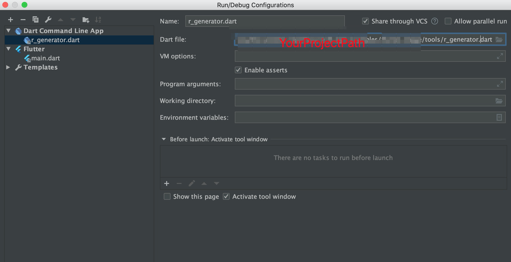
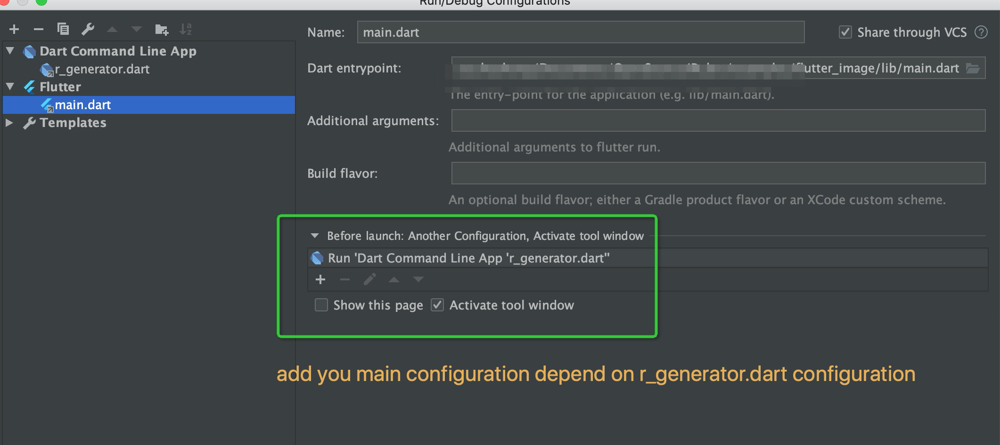

# R.dart
Get autocompleted resources like colors, images in Flutter projects

Have some idea from [**R.swift**](https://github.com/mac-cain13/R.swift) and [**asset_generator**](https://github.com/flutter-dev/asset_generator)


##Generate Assets and Colors

1. edit **pubspec.yaml** like below:

```
  # assets begin
  assets:
    - assets/animation/SimpleAnimation/images/
    - assets/image/
    - assets/file/
  # assets end
```
  
2. use **r_generator.dart** to generate **r.dart** in folder **generated**, you need copy **tools/r_generator.dart** to your project folder and then excute  
	 
```bash  
dart tools/r_generator.dart 
```  
you can use parameter **true** or **false** to control start the image preview server.

**You may want to automate this proceture.**

Use **Android Studio** please add configuration r_generator.dart 



and then add main configuration depend on it.



the file you generate may like:

``` dart
import 'dart:ui';

import 'package:flutter/widgets.dart';
 class R {
  // Generated Colors 
  /// <font color=#000000>#000000</font>
  static final Color colorBlack = Color.fromRGBO(0, 0, 0, 1.0);
  /// <font color=#ff00ff>#ff00ff</font>
  static final Color colorOrange = Color.fromRGBO(255, 0, 255, 1.0);
  /// <font color=#ffff00>#ffff00</font>
  static final Color colorYellow = Color.fromRGBO(255, 255, 0, 1.0);
  /// <font color=#1f000000>#1f000000</font>
  static final Color colorLightBlack = Color.fromRGBO(0, 0, 0, 0.12156862745098039);
  /// <font color=#ff0000>#ff0000</font>
  static final Color colorHomeListBackground = Color.fromRGBO(255, 0, 0, 1.0);
  
  // Generated Animations 
  /// assets/animation/SimpleAnimation
  static final String animationSimpleanimation = 'assets/animation/SimpleAnimation';
  
  // Generated Images 
  /// assets/image/camera\_botton.png
  static AssetImage get imageCameraBotton => const AssetImage('assets/image/camera_botton.png');
  /// assets/image/gaoyuanyuan.jpeg
  static AssetImage get imageGaoyuanyuan => const AssetImage('assets/image/gaoyuanyuan.jpeg');
  /// assets/image/google.png
  static AssetImage get imageGoogle => const AssetImage('assets/image/google.png');
  
  // Generated Other Assets 
  /// assets/file/listdata.json
  static final String fileListdata = 'assets/file/listdata.json';
  
}
```

3. import **generated/r.dart** then you can use the assets. run

``` bash
dart tools/image_server.dart
```
you can preview the image you generated variable refer.

4. if you are using animations like **Lottile**, you do not need the files in the animations folder to generate. you can put all you animations in folder "assets/animations" then the script **r_generator.dart** will automate generate animation names. 

you can use the generated resources like:

``` dart
body: Center(
        // Center is a layout widget. It takes a single child and positions it
        // in the middle of the parent.
        child: Column(
          children: <Widget>[
            Image(image: R.imageGaoyuanyuan),
            Container(
              height: 50,
              width: 80,
              color: R.colorOrange,
            ),
            Image(image: R.imageGoogle),
            Image(image: R.imageCameraBotton),
          ],
        ),
      ),
```
